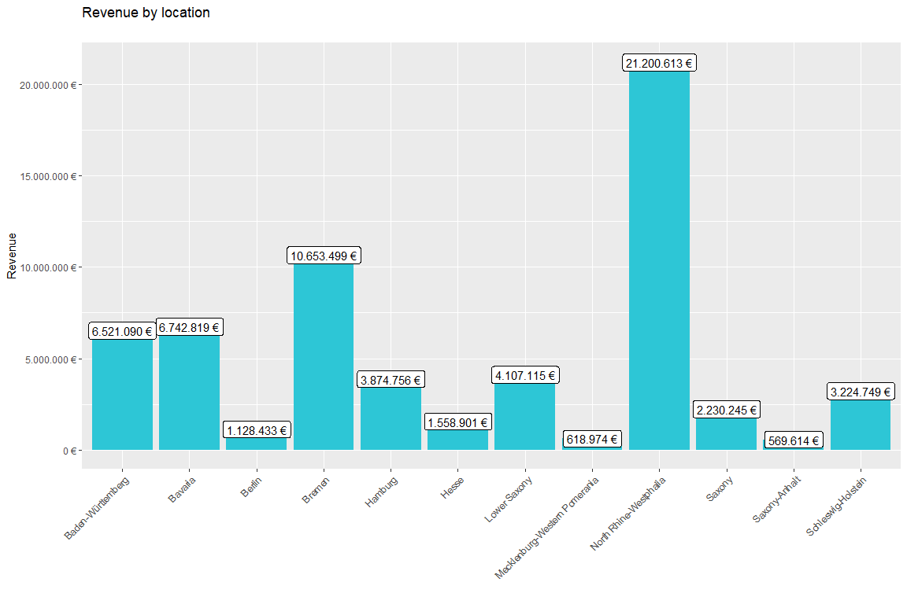
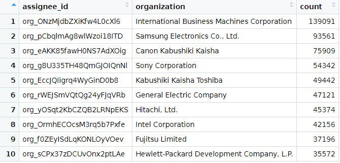
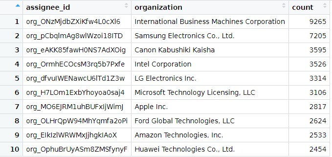
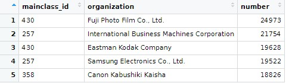
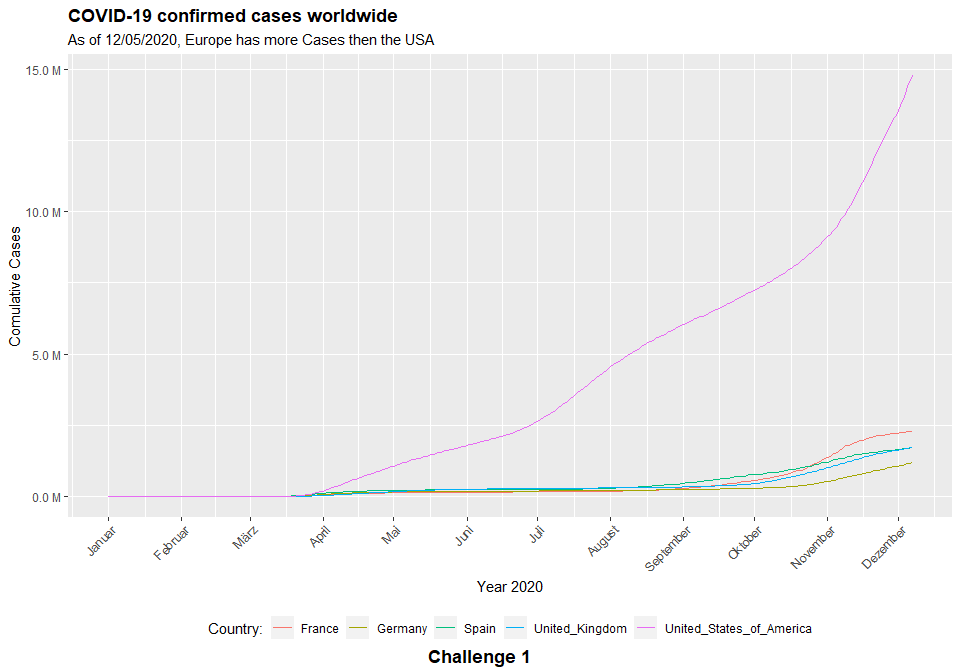
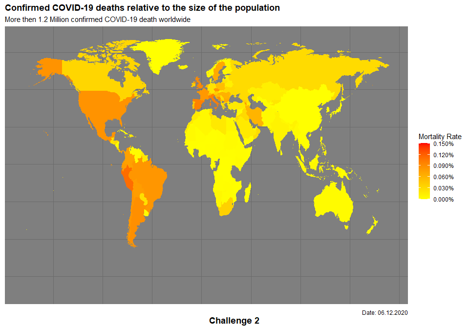

```{r setup, include=FALSE}
knitr::opts_chunk$set(message=FALSE,warning=FALSE, cache=TRUE)
```

**IMPORTANT:** You can delete everything in here and start fresh. You might want to start by not deleting anything above this line until you know what that stuff is doing.

This is an `.Rmd` file. It is plain text with special features. Any time you write just like this, it will be compiled to normal text in the website. If you put a \# in front of your text, it will create a top level-header.

# Tidyverse



In this figure you can see the revenue by location. North-Rhine-Westphalia is the state with the highest revenue


In this plot you can see the sales by location and year.

You can find the scripts in /journal_files/tidyverse/.

# Aquisition

You can find the scripts in /journal_files/aquisition/.

Unfortunately it seemes like I have overritten my running version of this script. It worked after Mister Schwarz gave me a hint in the chat. I don't want to push the time regulation more that I did already.

# Wrangling

In this figure you can see the 10 US companies with the most assigned/granted patents.



In this figure you see the top 10 companies with the most new granted patents for 2019.


In this figure you see the top 5 USPTO tech main classes for the top 10 companies (worldwide) with the most patents.



You can find the scripts in /journal_files/wrangling/.

# Visualization

In this figure you see the time course of the cumulative Covid-19 cases.


In this figure you can see the distribution of the mortality rate.


You can find the scripts in /journal_files/visualization/.

